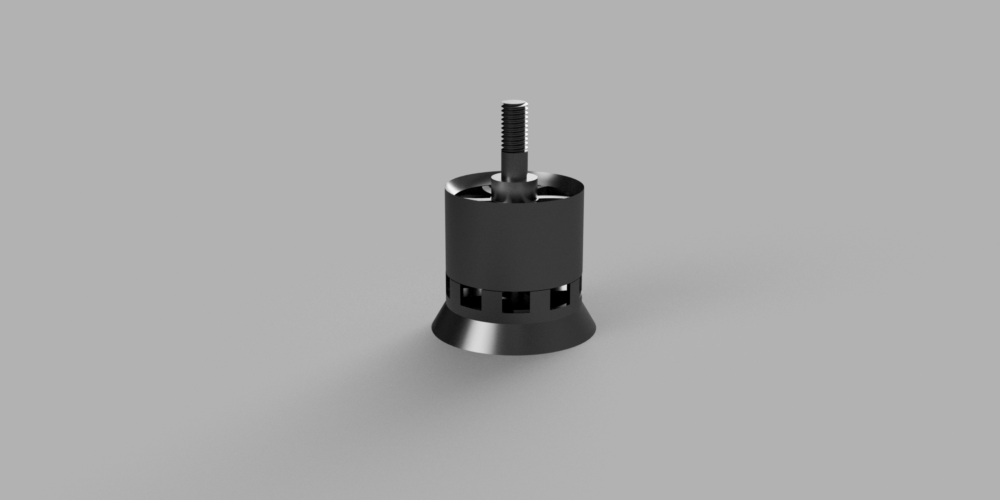

# KO_Method_SWR_2210_BLDC_Motor_3D_model

This repository contains 3D visualizations and reference materials for a BLDC motor design, including multiple rendered versions and a real image of the motor.

---

## 📷 Rendered Models

### Version 11

### Version 12

### Version 13

> 🧠 Each version includes slight adjustments in geometry, assembly fit, or visual polish. See the changelog or design notes for specific differences.

---

## 📸 Real Reference Photo

### KO Method SWR-2210 Motor

This image is used as a visual reference for modeling. All 3D models in this repo are inspired by its physical structure.

